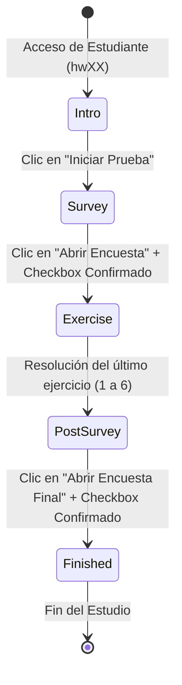

# Documentación Técnica: Módulo "Prueba Estudiantes" (Investigación de Tesis)

Este documento detalla la arquitectura, decisiones de diseño, tecnicismos e implementación del módulo **Prueba Estudiantes** (`src/pages/pruebaEstudiantes.tsx`), creado para la investigación de tesis sobre el uso de **Teclado Matemático** versus **Pizarra Digital Manuscrita** en el Tutor Inteligente de Matemáticas **Mateo Tutor**.

---

## 1. Propósito de la Investigación

El módulo tiene como objetivo evaluar de manera experimental la usabilidad, velocidad de respuesta y precisión de los estudiantes al transcribir y resolver expresiones matemáticas utilizando dos modalidades de entrada:
1. **Teclado Matemático:** Basado en botones interactivos de entrada virtual y el editor **MathQuill** (`EditableMathField`).
2. **Pizarra Digital Manuscrita:** Basado en un lienzo interactivo 2D Canvas (`MathPixBoard`) con reconocimiento óptico de caracteres (OCR) a través de la API de **MathPix**.

---

## 2. Archivos e Integraciones del Módulo

| Archivo / Componente | Ubicación | Función Principal |
| :--- | :--- | :--- |
| `pruebaEstudiantes.tsx` | `src/pages/` | Vista principal y máquina de estados (5 fases secuenciales). |
| `thesisSeeds.ts` | `src/utils/` | Algoritmo de cálculo de semillas ($N \pmod 6$) y asignación determinista de modalidades. |
| `MathPixBoard.tsx` | `src/components/whiteboard/` | Modal Canvas 2D para escritura a mano y conversión a LaTeX por OCR. |
| `MQStaticMathField.tsx` | `src/utils/` | Renderizador estático de expresiones LaTeX. |
| `action.ts` (`useAction`) | `src/utils/` | Hook para enviar la telemetría de la prueba a la API de Learner Model (UACh). |
| `Auth.tsx` (`withAuth`) | `src/components/` | Autenticación Auth0 y extracción de identificación de cuenta de prueba (`hw01`, `hw02`, etc.). |

---

## 3. Flujo Metodológico (Máquina de Estados de 5 Fases)

La página gestiona una máquina de estados mediante la variable `phase`:



1. **`intro` (Pantalla Principal):** Muestra la explicación de la prueba, la cuenta detectada (`hw01`, `hw02`, etc.) y la semilla asignada automáticamente (Semilla 0 a 5).
2. **`survey` (Encuesta Inicial - Google Forms):** Presenta el enlace al formulario de entrada. El Checkbox de confirmación permanece bloqueado hasta que el usuario hace clic en el botón de abrir la encuesta.
3. **`exercise` (Resolución 1 a 1):** Muestra los ejercicios secuencialmente. En cada ejercicio se presenta **únicamente** la herramienta asignada por la semilla (Teclado o Pizarra). Al presionar Enviar se registra la respuesta en LaTeX y se avanza automáticamente.
4. **`post_survey` (Encuesta Final - Google Forms):** Presenta el formulario de salida con validación por clic en el botón antes de permitir marcar la casilla de confirmación.
5. **`finished` (Pantalla Final):** Muestra el mensaje de agradecimiento y el resumen de la prueba tras haber completado todo el flujo.

---

## 4. Tecnicismos y Mecanismos de Implementación

### A. Algoritmo de Asignación Determinista de Semilla
Para garantizar un diseño experimental balanceado, la semilla (de 0 a 5) se calcula directamente a partir del identificador de la cuenta de prueba asignada al estudiante (`hw01`, `hw02`, `hw12`, etc.):

```typescript
export function getSeedFromUser(usernameOrEmail?: string | null) {
  const cleanUser = usernameOrEmail.toLowerCase().trim();
  const hwMatch = cleanUser.match(/hw0*(\d+)/i);
  if (hwMatch && hwMatch[1]) {
    const num = parseInt(hwMatch[1], 10);
    return { accountNum: num, seed: num % 6, accountName: cleanUser };
  }
  // Fallback si es otro formato de cuenta
  ...
}
```

Cada semilla (0 a 5) define de forma determinista qué ejercicios se resuelven mediante **Teclado** y cuáles mediante **Pizarra Digital**, variando el orden para evitar sesgos de aprendizaje.

---

### B. Telemetría de Tiempos por Ejercicio (Time Tracking)
Se mide de manera aislada únicamente el tiempo empleado en la copia/resolución de cada ejercicio individual:

- Se utiliza una referencia mutable `exerciseStartTimeRef = useRef<number>(Date.now())` que se reinicia al cargar cada ejercicio en `phase === "exercise"`.
- Al enviar la respuesta, se calcula la duración exacta:
  $$\text{timeSpentMs} = \text{endTime} - \text{startTime}$$
  $$\text{timeSpentSec} = \frac{\text{timeSpentMs}}{1000}$$
- Se envía este dato en la mutación `useAction` bajo la acción `thesisSubmitExercise` o `thesisPizarraCapture`:

```typescript
action({
  verbName: "thesisSubmitExercise",
  extra: {
    exerciseId: currentExercise.id,
    seed: currentSeed,
    mode: currentMode,
    inputLatex: finalLatex,
    targetLatex: currentExercise.targetLatex,
    user: userIdentifier,
    timeSpentMs,
    timeSpentSec,
    startTime,
    endTime,
  },
});
```

---

### C. Verificación de Interacción en Formularios de Google Forms
Para evitar que un estudiante marque las casillas de confirmación sin haber ingresado a los formularios:
- Se utilizan variables de estado booleanas (`hasClickedEntryForm` y `hasClickedExitForm`).
- Las casillas de confirmación incluyen la propiedad `cursor={hasClickedEntryForm ? "pointer" : "not-allowed"}` y una función `onClick` condicional.
- Si el usuario no ha presionado el botón para abrir el formulario, la casilla permanece inhabilitada y se muestra un badge de advertencia: `<Icon as={FaLock} /> Haz clic en "Abrir Encuesta" primero`.

---

### D. Persistencia de Sesión y Resiliencia (Fault Tolerance)
Para prevenir pérdida de progreso en caso de caída de internet, cierre accidental de pestaña o recarga de página (F5):
- El estado completo (`phase`, `currentExerciseIndex`, `hasClickedEntryForm`, `isEntrySurveyCompleted`, `hasClickedExitForm`, `isExitSurveyCompleted`, `submittedLatex`) se guarda en `localStorage` bajo la clave `thesis_progress_[usuario]`.
- Al cargar el componente, un `useEffect` verifica si existe una sesión previa pendiente y la restaura automáticamente, mostrando una notificación de reanudación.
- Al completar la prueba en la fase `finished`, se elimina la clave de `localStorage`.
- Se añade un listener nativo de `window.addEventListener("beforeunload", ...)` mientras el estudiante está en `phase === "exercise"` para prevenir cierres involuntarios del navegador.

---

### E. Diseño Adaptativo de Alto Contraste (Modo Claro & Oscuro)
Se implementaron tokens semánticos de **Chakra UI v3** para garantizar legibilidad completa sin importar el tema del navegador:
- Fondo de tarjetas adaptativo (`bg="bg.secondary"`: blanco en claro, carbón en oscuro).
- Textos primarios y secundarios adaptativos (`color="heading"`, `color="text_info"`, `color="fg.muted"`).
- Reglas CSS personalizadas para forzar alto contraste en campos matemáticos LaTeX:
  ```css
  .thesis-target-math-box .mq-root-block,
  .thesis-target-math-box .mq-math-mode,
  .thesis-target-math-box span {
    color: #ffffff !important;
  }
  ```

---

## 5. Eventos Registrados en la API de Learner Model

Todos los eventos de la prueba quedan auditados en el backend de la UACh mediante `useAction`:

1. `thesisStartIntro`: El estudiante presiona iniciar en la portada.
2. `thesisOpenEntryForm`: El estudiante hace clic en abrir la encuesta inicial.
3. `thesisSurveyCompleted`: El estudiante confirma haber respondido la encuesta inicial.
4. `thesisSubmitExercise`: El estudiante envía la respuesta a un ejercicio (incluye tiempo, modalidad, LaTeX objetivo y LaTeX ingresado).
5. `thesisPizarraCapture`: El estudiante completa la escritura en la pizarra manuscrita (incluye tiempo y objeto con respuesta OCR de MathPix).
6. `thesisOpenExitForm`: El estudiante hace clic en abrir la encuesta final de salida.
7. `thesisCompleteExperiment`: El estudiante completa exitosamente todo el flujo del estudio.
8. `thesisRestoreSession`: Se restaura automáticamente una sesión interrumpida desde `localStorage`.
